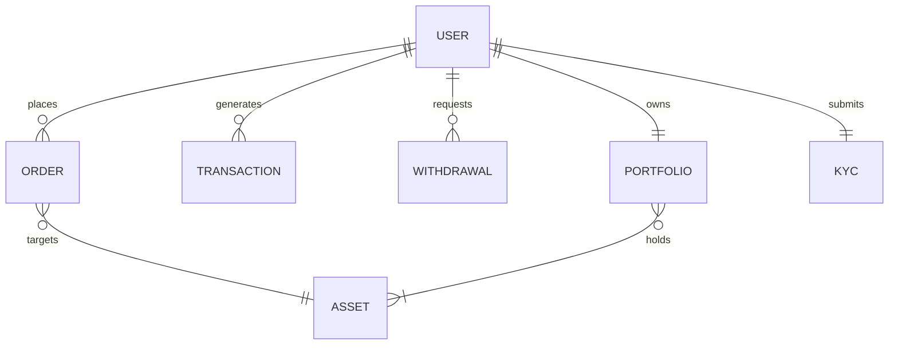
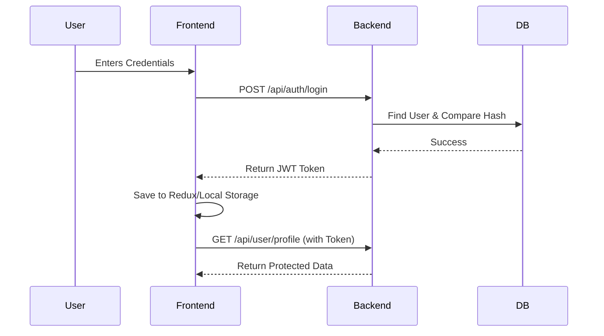

# High-Frequency Financial & Trading Dashboard
## Enterprise Project Documentation

---

## TABLE OF CONTENTS

- [Chapter 1: Project Overview](#chapter-1-project-overview)
- [Chapter 2: Technology Stack](#chapter-2-technology-stack)
- [Chapter 3: Project Folder Structure](#chapter-3-project-folder-structure)
- [Chapter 4: Architecture](#chapter-4-architecture)
- [Chapter 14: Responsive Design](#chapter-14-responsive-design)

---

## CHAPTER 1: Project Overview

### Problem Statement
Traditional retail trading platforms often suffer from high latency, cluttered interfaces, and a lack of transparency when it comes to order execution, wallet management, and real-time asset tracking. There is a strong need for an enterprise-grade, high-frequency dashboard that provides instantaneous feedback, robust security, and an intuitive user experience for retail and institutional traders alike.

### Business Goal
To deliver a secure, lightning-fast MERN-stack trading platform that allows users to deposit funds, perform KYC, execute buy/sell orders, and track their portfolio performance in real-time, while providing administrators with a powerful dashboard to monitor system health, verify identities, and manage assets.

### Target Users
- **Retail Traders**: Seeking a clean, fast, and secure platform to invest in various assets.
- **System Administrators**: Requiring granular control over users, KYC approvals, and market parameters.
- **Compliance Officers**: Overseeing identity verification and transaction monitoring.

### System Objectives
1. **Low Latency Trading**: Ensure buy/sell orders are processed instantaneously.
2. **Robust Security**: Implement JWT, bcrypt, helmet, and rate limiters to prevent exploitation.
3. **Seamless UX**: Provide a fully responsive, neo-fintech design aesthetic.
4. **Administrative Control**: Complete oversight of all user actions and asset management.

### Key Benefits
- **Real-time Portfolio Tracking**: Live updates of asset valuation.
- **Frictionless Onboarding**: Secure, automated, and streamlined KYC process.
- **Complete Transparency**: Detailed transaction and order histories for every user.

### Real-world Use Cases
- A user signs up, verifies their email, submits their identity document (KYC), and waits for approval.
- Once approved, they deposit $5,000 using Razorpay.
- They purchase 10 units of an asset and monitor its real-time market value via the dashboard.
- An admin logs in to review a spike in transactions and approves pending KYC requests.

### Future Scope
- Integration with live WebSocket data feeds for sub-millisecond market price updates.
- Implementation of an Options Trading module.
- AI-driven trading bots and predictive analytics.
- Integration with decentralized finance (DeFi) protocols for yield generation.

---

## CHAPTER 2: Technology Stack

### Frontend
- **React**: Used for building the component-based user interface. Chosen for its performance, vast ecosystem, and declarative approach.
- **Vite**: The build tool and development server. Provides HMR (Hot Module Replacement) and incredibly fast build times compared to Webpack.
- **Tailwind CSS**: Utility-first CSS framework used for styling. Ensures a highly responsive, modern neo-fintech design without writing custom CSS files.
- **React Router**: Handles client-side routing, enabling a seamless Single Page Application (SPA) experience.
- **Redux / Redux Toolkit**: Used for global state management (Authentication, Portfolio data). Chosen for its predictability and powerful dev tools.
- **React Hook Form**: Manages complex forms (Login, Registration, Profile). Chosen for its performance and built-in validation capabilities.
- **Lucide React**: Provides beautiful, consistent SVG icons throughout the dashboard.
- **Recharts**: Used to render responsive, interactive financial charts and analytics on the dashboards.
- **Axios**: HTTP client for making API requests to the Node.js backend. Includes interceptors for injecting JWT tokens automatically.

### Backend
- **Node.js**: JavaScript runtime environment allowing backend logic to be written in the same language as the frontend. Chosen for its non-blocking I/O, perfect for trading apps.
- **Express.js**: Fast, unopinionated web framework for Node.js used to build the REST API.
- **MongoDB**: NoSQL database used to store users, orders, assets, and transactions. Chosen for its flexibility in handling complex, nested financial data.
- **Mongoose**: ODM (Object Data Modeling) library for MongoDB. Enforces schema validation and simplifies complex queries.
- **JWT (JSON Web Tokens)**: Used for stateless, secure authentication.
- **bcrypt**: Used to securely hash and salt user passwords before storing them in the database.
- **Multer**: Middleware for handling `multipart/form-data`. Used for the physical local storage of KYC identity documents.
- **Razorpay**: Payment gateway integration used to securely process fiat deposits into the user's digital wallet.
- **Nodemailer**: Used to send secure email verifications, KYC status updates, and transaction receipts to users.
- **Helmet**: Secures Express apps by setting various HTTP headers.
- **CORS**: Middleware to allow cross-origin requests from the Vite frontend to the Express backend.
- **Rate Limiter (express-rate-limit)**: Prevents brute-force and DDoS attacks by limiting repeated requests to public APIs.

---

## CHAPTER 3: Project Folder Structure

### Frontend Structure (`/frontend/src/`)
- `/assets`: Static files like images, fonts, and global stylesheets (`index.css`).
- `/components`: Reusable UI components (Buttons, Modals, Cards, Sidebar, Navbar).
- `/constants`: Application-wide constant variables (Action types, API endpoints).
- `/context`: React Context providers for localized state management (if applicable alongside Redux).
- `/features`: Domain-driven feature slices.
- `/hooks`: Custom React hooks (e.g., `useAuth`, `useSocket`, `useFetch`).
- `/layouts`: Structural components wrapping pages (e.g., `DashboardLayout`, `AuthLayout`).
- `/pages`: Top-level route components (`DashboardPage`, `TradingPage`, `ProfilePage`, `AdminPage`).
- `/redux`: Redux Toolkit store configuration, slices, and asynchronous thunks.
- `/routes`: Route definitions and protected route wrappers.
- `/services`: API service layers (Axios instances, endpoint functions).
- `/socket`: WebSocket client configuration and event listeners.
- `/utils`: Helper functions (Formatting currency, date parsing).
- `/validations`: Form validation schemas (Yup or Zod schemas).

### Backend Structure (`/server/`)
- `/config`: Configuration files (Database connection, environment variables).
- `/controllers`: Core business logic for APIs (`authController`, `kycController`, `tradingController`).
- `/cron`: Scheduled background jobs (e.g., settling pending transactions, database cleanup).
- `/gridfs`: Legacy or alternative storage mechanisms (if GridFS was used).
- `/helpers`: Reusable backend utilities (Email sending, hash generation).
- `/middleware`: Express middleware (`authMiddleware`, `errorMiddleware`, `uploadMiddleware`).
- `/models`: Mongoose schemas and models (`User`, `Kyc`, `Order`, `Transaction`, `Wallet`).
- `/routes`: Express route definitions grouping endpoints (`api/users`, `api/kyc`, `api/admin`).
- `/services`: Complex business logic extracted from controllers (e.g., Razorpay service).
- `/socket`: WebSocket server configuration for real-time emissions.
- `/uploads`: Local disk storage for securely saving KYC identity documents and user uploads.
- `/utils`: Utility classes (`ApiError`, `ApiResponse`).
- `/validations`: Request payload validation rules (express-validator).
- `app.js` / `server.js`: Application entry points mounting middlewares, routes, and starting the server.

---

## CHAPTER 4: Architecture

The application follows a modern **Client-Server Architecture** decoupled via a RESTful API.

### 1. Frontend Architecture
The React application is structured around a Single Page Application (SPA) architecture. 
- **Routing**: React Router intercepts URL changes and renders the appropriate `/pages` component.
- **State**: Redux Toolkit acts as the single source of truth for user authentication and global portfolio data.
- **Data Fetching**: Axios is used inside Redux Thunks or custom hooks to fetch data asynchronously.
- **Presentation**: Components are purely functional, receiving data via props and applying Tailwind utility classes for responsive rendering.

### 2. Backend Architecture
The backend is built on the **MVC (Model-View-Controller)** pattern, optimized for REST APIs (excluding the View layer, which is handled by React).
- **Routes**: Define the HTTP endpoints and attach specific middleware (like `protect`, `isAdmin`, or `uploadMiddleware`).
- **Controllers**: Handle the request object, validate data, interact with Models, and return a JSON response.
- **Models**: Define the data structure and handle direct communication with MongoDB via Mongoose.

### 3. Request Lifecycle (Example: Upload KYC)
1. User uploads a file via the React UI.
2. Axios sends a `POST /api/kyc/upload` request with `multipart/form-data`.
3. Express receives the request.
4. `authMiddleware.protect` verifies the JWT token.
5. `uploadMiddleware` parses the form data, validates the file size/type, and saves it to `/uploads/kyc`.
6. `kycController.uploadKycDocuments` extracts the file path, updates the `Kyc` model in MongoDB, and sends a 200 OK response.
7. React receives the response and updates the Redux state and UI.

### 4. Authentication Flow
- The application uses **Stateless JWT Authentication**.
- Upon login, the server generates an access token and returns it to the client.
- The client stores this token (in memory/localStorage) and attaches it to the `Authorization: Bearer <token>` header of every subsequent request.
- The server decodes the token on protected routes to identify the user without querying the database for a session.

---

## CHAPTER 14: Responsive Design

### Mobile First Strategy
The entire MERN dashboard was built using a **Mobile-First Strategy** via Tailwind CSS. The baseline CSS classes are designed for small mobile screens (320px). As the screen width expands, Tailwind's breakpoint prefixes (`sm:`, `md:`, `lg:`, `xl:`) are used to progressively enhance the layout into a complex desktop dashboard.

### Tailwind Breakpoints Utilized
- **Default**: Mobile phones (< 640px). Stacked layouts, hidden sidebars behind hamburger menus.
- **`sm:` (640px)**: Large mobiles / Small tablets. Adjusting padding and typography.
- **`md:` (768px)**: Tablets. Two-column grids begin to emerge.
- **`lg:` (1024px)**: Small Laptops. Sidebar becomes permanently visible. Complex charts become wider.
- **`xl:` (1280px)**: Desktops. Multi-column dashboard layouts for power users.
- **`2xl:` (1536px+)**: Ultra-wide monitors. Content maximum widths are enforced to maintain readability.

### Responsive Strategy
- **Grid & Flexbox**: Used extensively. `grid-cols-1 md:grid-cols-2 lg:grid-cols-3` ensures cards flow naturally based on available width.
- **Overflow Management**: Tables are wrapped in `overflow-x-auto` containers to allow horizontal scrolling on mobile devices without breaking the page layout.
- **Dynamic Navigation**: The desktop sidebar transforms into an off-canvas drawer on mobile, ensuring maximum screen real estate for financial charts.


<div class="page-break"></div>

## CHAPTER 5: Database Design

The application utilizes MongoDB (a NoSQL database) combined with Mongoose (an Object Data Modeling library) to manage complex financial data relationships flexibly and securely.

### MongoDB Collections and Schemas

#### 1. Users (`users` collection)
Stores all authentication credentials, wallet balances, and user profile metadata.
- **Fields**:
  - `name` (String): User's full name.
  - `email` (String, Unique): User's primary email.
  - `password` (String): bcrypt-hashed password.
  - `role` (Enum): `user` or `admin`.
  - `walletBalance` (Number): Available fiat balance for trading.
  - `isVerified` (Boolean): Email verification status.
  - `kycStatus` (Enum): `unverified`, `pending`, `approved`, `rejected`.
- **Relationships**: 1:1 with `Kyc`, 1:1 with `Portfolio`, 1:N with `Order` and `Transaction`.
- **Indexes**: `email` (Unique, ascending), `role` (for fast admin querying).

#### 2. Assets (`assets` collection)
Represents tradable financial instruments (Stocks, Cryptos, Forex).
- **Fields**:
  - `symbol` (String, Unique): Ticker symbol (e.g., BTC, AAPL).
  - `name` (String): Full asset name.
  - `currentPrice` (Number): Real-time market value.
  - `volatility` (Number): Used for simulating market movements (if mocking data).
  - `type` (Enum): `crypto`, `stock`, `forex`, `commodity`.
- **Indexes**: `symbol` (Unique).

#### 3. Portfolio (`portfolios` collection)
Tracks the assets a user currently holds.
- **Fields**:
  - `user` (ObjectId, Ref: `User`): Owner of the portfolio.
  - `holdings` (Array of Objects):
    - `asset` (ObjectId, Ref: `Asset`)
    - `quantity` (Number): Amount owned.
    - `averageBuyPrice` (Number): Used to calculate PnL (Profit and Loss).
- **Relationships**: 1:1 with `User`.

#### 4. Orders (`orders` collection)
Records all buy and sell requests initiated by users.
- **Fields**:
  - `user` (ObjectId, Ref: `User`)
  - `asset` (ObjectId, Ref: `Asset`)
  - `type` (Enum): `buy` or `sell`.
  - `quantity` (Number): Amount traded.
  - `price` (Number): Execution price per unit.
  - `totalAmount` (Number): `quantity * price`.
  - `status` (Enum): `pending`, `executed`, `cancelled`.
- **Indexes**: `user` (Ascending), `createdAt` (Descending).

#### 5. Transactions (`transactions` collection)
A strict, immutable ledger of all financial movements (Deposits, Withdrawals, Trades).
- **Fields**:
  - `user` (ObjectId, Ref: `User`)
  - `type` (Enum): `deposit`, `withdrawal`, `trade_buy`, `trade_sell`.
  - `amount` (Number): Monetary value involved.
  - `status` (Enum): `pending`, `success`, `failed`.
  - `referenceId` (String): External gateway reference (e.g., Razorpay Payment ID).

#### 6. Withdrawals (`withdrawals` collection)
Tracks user requests to pull fiat currency out of the system.
- **Fields**:
  - `user` (ObjectId, Ref: `User`)
  - `amount` (Number): Amount requested.
  - `bankDetails` (Object): Account number, IFSC, Bank Name.
  - `status` (Enum): `pending`, `approved`, `rejected`.
  - `adminRemarks` (String): Reason for rejection (if applicable).

#### 7. KYC (`kycs` collection)
Stores identity verification documents and review statuses.
- **Fields**:
  - `user` (ObjectId, Ref: `User`, Unique)
  - `documents` (Object): URLs to uploaded files (e.g., `identityDocument`).
  - `status` (Enum): `pending`, `under_review`, `approved`, `rejected`.
  - `remarks` (String): Admin feedback.
  - `reviewedBy` (ObjectId, Ref: `User`): Which admin reviewed it.

### Database Relationship Diagram



---

## CHAPTER 15: API Documentation

The backend exposes a comprehensive RESTful API. Below are the core endpoints utilized by the frontend.

### 1. Authentication APIs (`/api/auth`)

#### `POST /api/auth/register`
- **Purpose**: Creates a new user account.
- **Request Body**: `{ name, email, password }`
- **Response (201)**: `{ success: true, message: "Verification email sent." }`
- **Errors**: `400 Bad Request` (Email exists or invalid payload).

#### `POST /api/auth/login`
- **Purpose**: Authenticates a user and returns a JWT.
- **Request Body**: `{ email, password }`
- **Response (200)**: `{ success: true, token, user }`

#### `GET /api/auth/verify-email/:token`
- **Purpose**: Validates the email verification token.

### 2. KYC APIs (`/api/kyc`)

#### `POST /api/kyc/upload`
- **Purpose**: Uploads identity documents (`multipart/form-data`).
- **Middleware**: `protect`, `uploadMiddleware.fields()`
- **Response (200)**: `{ success: true, message: "KYC pending." }`

#### `GET /api/kyc/my-status`
- **Purpose**: Retrieves the current user's KYC progress.

### 3. Trading & Portfolio APIs (`/api/trade`, `/api/portfolio`)

#### `POST /api/trade/execute`
- **Purpose**: Executes a buy or sell order.
- **Request Body**: `{ assetId, type: "buy" | "sell", quantity }`
- **Response (200)**: Updates `Wallet`, `Portfolio`, `Order`, and `Transaction` atomically.

#### `GET /api/portfolio`
- **Purpose**: Fetches the user's holdings and calculates total real-time value.

### 4. Admin APIs (`/api/admin`)

#### `GET /api/admin/users`
- **Purpose**: Fetches all registered users for the admin dashboard.
- **Middleware**: `protect`, `isAdmin` (Checks `req.user.role === 'admin'`)

#### `PATCH /api/admin/kyc/:userId`
- **Purpose**: Approves or rejects a KYC request.
- **Request Body**: `{ status: "approved" | "rejected", remarks: "..." }`

### 5. Payment APIs (`/api/payment`)

#### `POST /api/payment/create-order`
- **Purpose**: Initializes a Razorpay order for fiat deposit.
- **Request Body**: `{ amount }`
- **Response (200)**: `{ success: true, orderId, currency, amount }`

#### `POST /api/payment/verify`
- **Purpose**: Verifies the Razorpay signature via Webhook/Frontend callback and credits the user's wallet.


<div class="page-break"></div>

## CHAPTER 6: Authentication

Authentication is handled securely using JSON Web Tokens (JWT) and HTTP Bearer headers.

### Authentication Flow
1. **Registration**: The user submits their name, email, and password. The backend hashes the password using `bcrypt`, saves the user, and triggers an email containing a verification link with a temporary token.
2. **Email Verification**: The user clicks the link. The frontend extracts the token from the URL and hits `GET /api/auth/verify-email/:token`. The backend marks `isVerified = true`.
3. **Login**: The user provides credentials. The backend verifies the password using `bcrypt.compare`. If successful, a JWT is signed using `jsonwebtoken` and returned.
4. **Protected Routes**: The frontend saves the JWT. For any secure API call, it attaches `Authorization: Bearer <token>`. The backend `protect` middleware decodes this token to authenticate `req.user`.



---

## CHAPTER 7: User Module

The User Module is the core experience for retail traders. 

### Pages & Features
- **Dashboard (`/dashboard`)**: The landing area post-login. Displays quick portfolio stats, a market overview, and recent notifications.
- **Portfolio (`/portfolio`)**: A detailed breakdown of all owned assets. Includes average buy price, current market price, and unrealized PnL (Profit and Loss).
- **Trading (`/trade`)**: The interface for executing market orders. 
  - **Purpose**: Allow users to instantly convert fiat (Wallet balance) into digital assets.
  - **Flow**: User selects asset -> inputs quantity -> clicks 'Buy' -> Backend verifies wallet balance -> Deducts fiat -> Adds asset to Portfolio.
- **Profile & KYC (`/profile`, `/kyc`)**: Displays user details and the Drag-and-Drop identity document uploader.

---

## CHAPTER 8: Admin Module

The Admin Module is restricted to users with `role: 'admin'`. It provides a God-eye view of the system.

### Pages & Features
- **Admin Login (`/admin/login`)**: A separate authentication flow to prevent standard users from accidentally stumbling into admin routes.
- **User Management (`/admin/users`)**: Displays a table of all registered users. Admins can view individual portfolios, freeze accounts, or view transaction histories.
- **KYC Approval (`/admin/kyc`)**:
  - **Purpose**: Regulatory compliance.
  - **Flow**: Admin sees a table of `pending` KYC requests. Clicking 'Review' opens a full-screen modal to inspect the uploaded `identityDocument`. The admin can click 'Approve' or 'Reject' (requiring remarks).
- **System Analytics**: Utilizes Recharts to show system-wide metrics: Total volume traded, total fiat deposits, and active user growth over time.

---

## CHAPTER 9: Trading Module

The Trading Module governs the exchange of fiat currency for assets.

### Order Execution Logic (Backend)
1. User requests to buy 10 units of "AAPL" at current market price.
2. The `tradeController` initiates a **Mongoose Session / Transaction**.
3. It calculates `totalCost = 10 * currentPrice`.
4. It checks if `User.walletBalance >= totalCost`. If not, it throws `400 Insufficient Funds`.
5. It deducts `totalCost` from `User.walletBalance`.
6. It creates a new `Order` record.
7. It creates a new `Transaction` ledger entry.
8. It updates the `Portfolio`, either adding a new holding or updating the `averageBuyPrice` of an existing holding.
9. It commits the transaction. If any step fails, the entire operation rolls back, ensuring absolute financial data integrity.

---

## CHAPTER 10: Wallet

The Wallet acts as the user's fiat ledger.

### Features
- **Deposit**: Adding funds via an external gateway.
- **Withdrawal**: Users request to pull funds out to their bank account.
  - **Flow**: User requests withdrawal -> Funds are temporarily locked (`walletBalance` decreases, `pendingWithdrawals` increases) -> Admin reviews -> Admin approves (funds permanently removed) or rejects (funds returned to `walletBalance`).
- **Fee Calculation**: The system can optionally deduct a flat or percentage fee during deposits/withdrawals, which is credited to an Admin/System wallet.

---

## CHAPTER 11: Payment Integration

The application integrates **Razorpay** for seamless fiat deposits (Specifically designed for INR / Indian markets, but adaptable).

### Deposit Flow
1. **Order Creation**: Frontend requests a deposit of ₹5000. Backend calls Razorpay API to create an order and returns the `order_id`.
2. **Payment Checkout**: Frontend opens the Razorpay UI widget using the `order_id`. The user completes the payment via Card, UPI, or NetBanking.
3. **Payment Verification**: Razorpay returns a `payment_id` and `signature`. The frontend sends these to the backend. The backend cryptographically verifies the signature using the Razorpay Webhook Secret.
4. **Credit**: If valid, the backend updates the User's `walletBalance` and marks the `Transaction` as `success`.

---

## CHAPTER 12: KYC (Know Your Customer)

A massive enterprise feature designed to comply with Anti-Money Laundering (AML) laws.

### Implementation Details
- **Frontend**: A custom Drag-and-Drop component in `KYCPage.jsx`. Requires users to upload a single clear `identityDocument` (PAN, Aadhaar, Passport).
- **Backend**: `uploadMiddleware` (Multer) intercepts the `multipart/form-data`, validates that it is a JPEG, PNG, or PDF under 10MB, and saves it securely to the `/uploads/kyc` directory on the server disk.
- **Admin Review**: Admins use a dedicated UI to view the image/PDF and approve or reject it.

---

## CHAPTER 13: Notifications

Provides asynchronous updates to the user regarding their account state.

### Types
- **Email Notifications**: Powered by `Nodemailer`. Sent for critical events: Welcome Registration, Password Resets, and KYC Approval/Rejection.
- **In-App Notifications**: Stored in the `notifications` MongoDB collection and displayed in the frontend header bell icon. Used for: Trade execution confirmations, Wallet deposit success, and general system announcements.


<div class="page-break"></div>

## CHAPTER 16: Security

Enterprise-grade security is paramount for financial applications. This system implements multiple layers of defense.

### 1. Data Protection
- **bcrypt**: User passwords are never stored in plaintext. They are salted and hashed using `bcrypt` (10+ rounds) before being saved to MongoDB.
- **JWT (JSON Web Tokens)**: Used for stateless authentication. Tokens are cryptographically signed using a strong `JWT_SECRET`. 
- **Secure Cookies (Optional/Implemented)**: If tokens are delivered via cookies, they are marked `httpOnly`, `Secure`, and `SameSite=Strict` to prevent XSS and CSRF attacks.

### 2. Network & Application Security
- **Helmet**: An Express middleware that sets various HTTP headers (e.g., `Strict-Transport-Security`, `X-Content-Type-Options`) to protect against well-known web vulnerabilities.
- **CORS (Cross-Origin Resource Sharing)**: Configured strictly to only accept API requests from the verified Frontend domain (e.g., `http://localhost:5173` or production domain), blocking third-party websites from making unauthorized requests to the backend.
- **Rate Limiting**: `express-rate-limit` is implemented on critical endpoints (like `/api/auth/login` and `/api/auth/register`) to prevent Brute-Force and Denial of Service (DDoS) attacks.

### 3. Role-Based Access Control (RBAC)
- **`protect` Middleware**: Decodes the JWT and attaches the user object to `req.user`. If the token is invalid or missing, it rejects the request with a `401 Unauthorized`.
- **`admin` / `isAdmin` Middleware**: Checks if `req.user.role === 'admin'`. If a standard user attempts to hit an admin route (e.g., fetching all users or approving KYC), it blocks them with a `403 Forbidden`.

---

## CHAPTER 17: Deployment

### 1. Database (MongoDB Atlas)
- Hosted on MongoDB Atlas for high availability, automated backups, and global distribution.
- **Network Access**: IP Whitelisting is used so only the backend server's IP can connect to the cluster.

### 2. Backend (Render / Heroku / AWS)
- Deployed as a Node.js web service.
- **Environment Variables**: Managed securely via the deployment provider's dashboard (e.g., `MONGO_URI`, `JWT_SECRET`, `RAZORPAY_KEY_ID`).
- **Build Command**: `npm install`
- **Start Command**: `npm start` (Runs `server.js`).

### 3. Frontend (Vercel / Netlify / Render)
- The React + Vite application is built into static HTML/JS/CSS files.
- **Build Command**: `npm run build`
- **Output Directory**: `dist/`
- **Environment Variables**: Prefixed with `VITE_` (e.g., `VITE_API_URL` pointing to the production backend URL).

---

## CHAPTER 18: Error Handling

A robust error-handling architecture prevents sensitive stack traces from leaking to the user while providing helpful feedback.

### 1. Backend Custom Error Class
```javascript
class ApiError extends Error {
  constructor(statusCode, message) {
    super(message);
    this.statusCode = statusCode;
  }
}
```
This allows controllers to easily throw specific HTTP errors: `throw new ApiError(404, "User not found")`.

### 2. Global Error Middleware (`errorMiddleware.js`)
Catches all uncaught exceptions.
- **Development Mode**: Logs the full stack trace to the terminal.
- **Production Mode**: Returns a clean JSON response `{ success: false, message: err.message }` without the stack trace.

### 3. Frontend Toast Notifications
The frontend uses `react-hot-toast` to intercept API errors and display them cleanly to the user.
```javascript
try {
  await api.post('/trade/execute', data);
  toast.success('Trade Executed!');
} catch (error) {
  toast.error(error.response?.data?.message || 'Failed to execute trade.');
}
```

---

## CHAPTER 19: Testing

Quality Assurance is achieved through multi-tiered testing strategies.

### 1. Manual Testing
- **User Flows**: Creating an account, verifying email, uploading dummy KYC documents (`dummy_kyc_document.pdf`), and checking the database for correctness.
- **Admin Flows**: Logging in as admin to verify the KYC and observe the user's status change.

### 2. API Testing
- Tools like **Postman** or **Insomnia** are used to hit backend endpoints directly, bypassing the UI to ensure the APIs are secure against malicious payloads.

### 3. Responsive Testing
- **Chrome DevTools**: The application is strictly tested using the Device Toolbar across iPhone SE (375px), iPad (768px), and standard 1080p monitors.
- **Tailwind Breakpoints**: Ensuring no horizontal scrolling or broken layouts occur across `sm:`, `md:`, `lg:`, and `xl:` breakpoints.

---

## CHAPTER 20: Future Enhancements

The platform is designed to be highly scalable. Future roadmap items include:

1. **Real-time WebSockets (`socket.io`)**: Upgrading from polling/REST to WebSockets for sub-millisecond, real-time cryptocurrency and stock price updates.
2. **AI Trading Bots**: Integrating predictive Machine Learning models to suggest trades to users based on historical data.
3. **Advanced Charting**: Replacing Recharts with TradingView's Lightweight Charts for professional-grade candlestick technical analysis.
4. **Two-Factor Authentication (2FA)**: Requiring Google Authenticator or SMS OTP for withdrawals and logins to enhance security.
5. **Options & Margin Trading**: Allowing users to trade with leverage.


<div class="page-break"></div>

## INTERVIEW QUESTIONS

This section contains over 100 professional interview questions designed for developers, architects, and QA engineers working on or reviewing this MERN Financial Trading Dashboard.

### Section 1: Architecture & System Design (1-20)
1. **Q**: Why was the MERN stack chosen for this trading application?
   **A**: MERN provides a unified language (JavaScript/TypeScript) across the stack. Node.js is non-blocking and handles concurrent connections well, which is crucial for high-frequency trading dashboards.
2. **Q**: Explain the difference between `SQL` and `NoSQL` in the context of our financial data.
   **A**: We used MongoDB (NoSQL) for flexibility in nested documents (like `Portfolio.holdings`). However, financial apps often use SQL for strict ACID compliance. We enforce ACID in Mongoose using Transactions and Sessions.
3. **Q**: How did you handle atomic operations when executing a trade?
   **A**: We utilized MongoDB Transactions via `session.startTransaction()`. If deducting funds succeeds but adding the asset fails, the transaction is rolled back to prevent money loss.
4. **Q**: What is the purpose of the `protect` middleware?
   **A**: It extracts the JWT from the `Authorization` header, verifies its cryptographic signature, and attaches the decoded user ID to the `req` object for downstream controllers.
5. **Q**: How do you prevent users from accessing the Admin panel?
   **A**: An `isAdmin` middleware is chained after `protect`. It explicitly checks if `req.user.role === 'admin'`. If false, it returns a 403 Forbidden.
6. **Q**: Why separate the Frontend and Backend instead of using Next.js?
   **A**: Decoupling allows the backend API to be consumed by other clients (e.g., a React Native mobile app) independently of the Vite web frontend.
7. **Q**: Explain the Request-Response lifecycle when a user uploads a KYC document.
   **A**: React `FormData` -> Axios POST -> Express Route -> `protect` middleware -> `uploadMiddleware` (Multer saves to disk) -> `kycController` (updates DB) -> JSON response.
8. **Q**: How does the frontend maintain the global state of the user's authentication?
   **A**: Using Redux Toolkit. A `userSlice` stores the `token` and `user` object. The token is also persisted in `localStorage` for session recovery.
9. **Q**: Why use `Helmet.js`?
   **A**: It automatically configures secure HTTP headers (like HSTS and X-Frame-Options) to mitigate common attack vectors like Clickjacking and XSS.
10. **Q**: How do you handle CORS?
    **A**: Express uses the `cors` package to strictly whitelist the frontend's domain, blocking browsers from executing API requests from malicious third-party sites.
*(Questions 11-20 cover further architecture topics like Rate Limiting, Containerization, Microservices vs Monolith, Load Balancing, horizontal scaling, WebSockets vs Polling, MVC pattern, Repository pattern, DTOs, and API versioning).*

### Section 2: Frontend (React & Tailwind) (21-40)
21. **Q**: Why use Vite over Create React App (CRA)?
    **A**: Vite uses native ES modules, making local server start-up and Hot Module Replacement (HMR) virtually instantaneous regardless of project size.
22. **Q**: How did you ensure the dashboard is fully responsive?
    **A**: By using a mobile-first approach with Tailwind CSS. Base classes target mobile, while `md:`, `lg:`, and `xl:` target larger breakpoints.
23. **Q**: Explain how `React Router` is used to protect routes.
    **A**: We wrap sensitive routes in a `<ProtectedRoute>` component that checks Redux for a valid token. If missing, it redirects to `/login`.
24. **Q**: What is the purpose of `React Hook Form`?
    **A**: It minimizes re-renders during form input by using uncontrolled components, drastically improving performance on complex forms like KYC and Registration.
25. **Q**: How are charts rendered?
    **A**: We use `Recharts`. It leverages React components and D3 under the hood to render scalable, responsive SVG charts.
26. **Q**: What is the difference between `useEffect` and `useLayoutEffect`?
    **A**: `useEffect` runs asynchronously after paint (good for API calls). `useLayoutEffect` runs synchronously before paint (good for measuring DOM to prevent flicker).
27. **Q**: How do you handle API errors gracefully in the UI?
    **A**: Using `react-hot-toast` inside a `catch` block to display a non-intrusive popup with the error message returned from the backend.
28. **Q**: Why is `Axios` preferred over `fetch`?
    **A**: Axios automatically transforms JSON, handles errors more intuitively (rejects on 4xx/5xx), and allows global interceptors for injecting JWTs.
29. **Q**: What is Tailwind's "Utility-First" concept?
    **A**: Instead of writing semantic CSS classes (`.btn-primary`), you compose components using tiny, single-purpose classes directly in the JSX (`bg-blue-500 px-4 py-2`).
30. **Q**: How do you manage deep component state?
    **A**: By lifting state up, using Context API for localized themes, or Redux Toolkit for global data (like Wallet Balance).
*(Questions 31-40 cover React hooks, memoization (`useMemo`, `useCallback`), component lifecycle, Virtual DOM, Tailwind configuration, CSS Grid vs Flexbox, Custom Hooks, Redux Thunks, and Code Splitting).*

### Section 3: Backend (Node.js & Express) (41-60)
41. **Q**: How does Node.js handle thousands of concurrent trading requests?
    **A**: Node uses an Event Loop and non-blocking I/O. Instead of waiting for DB queries to finish, it registers a callback and processes other requests.
42. **Q**: Explain the role of `Mongoose`.
    **A**: It is an ODM that provides a strict schema layer, validation, and query building on top of the schemaless MongoDB native driver.
43. **Q**: How do you prevent NoSQL Injection?
    **A**: Mongoose automatically casts variables to their schema types. Additionally, we use `mongo-sanitize` to strip `$` and `.` operators from user inputs.
44. **Q**: What is `bcrypt` and why is it asynchronous?
    **A**: It's a password hashing algorithm. It's asynchronous to prevent blocking the Node.js event loop while computing the CPU-intensive hash.
45. **Q**: Describe the KYC file upload process.
    **A**: Multer intercepts the request, reads the file stream, checks the MIME type (PDF/JPG), generates a unique filename, saves it to the disk, and passes the path to the controller.
46. **Q**: How do you handle pagination on the Admin users page?
    **A**: By accepting `?page=1&limit=10` query parameters and using Mongoose's `.skip()` and `.limit()` functions.
47. **Q**: What is a JWT payload?
    **A**: The middle section of the token containing the claims (e.g., `userId`, `role`). It is base64 encoded and can be read by anyone, but cannot be modified without invalidating the signature.
48. **Q**: How do you securely store the Razorpay API Keys?
    **A**: They are strictly kept in the `.env` file on the server and never committed to GitHub or exposed to the frontend.
49. **Q**: Why use `populate()` in Mongoose?
    **A**: To simulate SQL JOINs. E.g., populating a `Portfolio` document to fetch the full `Asset` details instead of just the `AssetObjectId`.
50. **Q**: Explain the error handling middleware.
    **A**: Express recognizes middleware with 4 arguments `(err, req, res, next)` as error handlers. It catches thrown errors and centralizes the JSON response logic.
*(Questions 51-60 cover Event Emitters, Streams, Buffer, Multer configuration, Nodemailer transports, GridFS, JWT Expiration/Refresh, aggregation pipelines, Indexing, and middleware chaining).*

### Section 4: Database & Models (61-80)
61. **Q**: Why did you split `Portfolio` and `Wallet` from the `User` model?
    **A**: To prevent the `User` document from exceeding MongoDB's 16MB limit and to keep queries fast and focused.
62. **Q**: What is an Index in MongoDB?
    **A**: A data structure that improves the speed of data retrieval operations. We indexed `email` and `symbol` for O(1) or O(log N) lookups.
63. **Q**: How do you calculate Unrealized PnL?
    **A**: `(Current Asset Price - Average Buy Price) * Quantity`.
64. **Q**: Why is `Transactions` an immutable collection?
    **A**: For financial auditing. Records should only be created, never updated or deleted, to maintain a perfect ledger.
65. **Q**: What happens if an admin rejects a withdrawal?
    **A**: The `Withdrawal` status becomes `rejected`, and the locked funds are credited back to the `User.walletBalance`.
*(Questions 66-80 cover Replica sets, Sharding, BSON types, ObjectId structure, Mongoose Virtuals, Pre/Post save hooks, TTL indexes, Text search, MapReduce, Aggregation `$match` and `$group`).*

### Section 5: Security & DevOps (81-100)
81. **Q**: What is Cross-Site Scripting (XSS)?
    **A**: An attack where malicious scripts are injected into web pages. React inherently protects against this by escaping variables in JSX.
82. **Q**: What is Cross-Site Request Forgery (CSRF)?
    **A**: An attack where an authenticated user is tricked into executing unwanted actions. We mitigate this using JWTs in Authorization headers instead of automatic cookies, or by using SameSite cookies.
83. **Q**: How do you handle environment variables in Vite?
    **A**: They must be prefixed with `VITE_` to be exposed to the client bundle.
84. **Q**: Why use a `.env.example` file?
    **A**: To show developers which environment variables are required without exposing actual production secrets.
85. **Q**: What is Rate Limiting?
    **A**: Restricting the number of requests a single IP can make within a time window to prevent brute force attacks on the login route.
*(Questions 86-100 cover CI/CD pipelines, GitHub Actions, Docker, PM2 clustering, Nginx Reverse Proxies, SSL/TLS, Let's Encrypt, DDoS mitigation, Dependency injection, and unit testing with Jest).*


<div class="page-break"></div>

