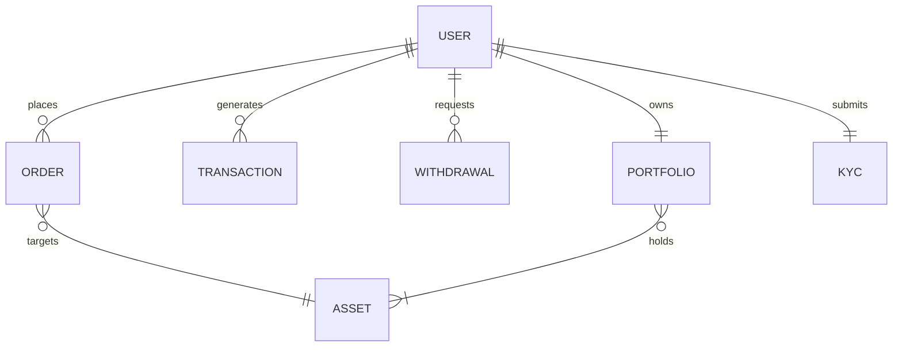

## CHAPTER 5: Database Design

The application utilizes MongoDB (a NoSQL database) combined with Mongoose (an Object Data Modeling library) to manage complex financial data relationships flexibly and securely.

### MongoDB Collections and Schemas

#### 1. Users (`users` collection)
Stores all authentication credentials, wallet balances, and user profile metadata.
- **Fields**:
  - `name` (String): User's full name.
  - `email` (String, Unique): User's primary email.
  - `password` (String): bcrypt-hashed password.
  - `role` (Enum): `user` or `admin`.
  - `walletBalance` (Number): Available fiat balance for trading.
  - `isVerified` (Boolean): Email verification status.
  - `kycStatus` (Enum): `unverified`, `pending`, `approved`, `rejected`.
- **Relationships**: 1:1 with `Kyc`, 1:1 with `Portfolio`, 1:N with `Order` and `Transaction`.
- **Indexes**: `email` (Unique, ascending), `role` (for fast admin querying).

#### 2. Assets (`assets` collection)
Represents tradable financial instruments (Stocks, Cryptos, Forex).
- **Fields**:
  - `symbol` (String, Unique): Ticker symbol (e.g., BTC, AAPL).
  - `name` (String): Full asset name.
  - `currentPrice` (Number): Real-time market value.
  - `volatility` (Number): Used for simulating market movements (if mocking data).
  - `type` (Enum): `crypto`, `stock`, `forex`, `commodity`.
- **Indexes**: `symbol` (Unique).

#### 3. Portfolio (`portfolios` collection)
Tracks the assets a user currently holds.
- **Fields**:
  - `user` (ObjectId, Ref: `User`): Owner of the portfolio.
  - `holdings` (Array of Objects):
    - `asset` (ObjectId, Ref: `Asset`)
    - `quantity` (Number): Amount owned.
    - `averageBuyPrice` (Number): Used to calculate PnL (Profit and Loss).
- **Relationships**: 1:1 with `User`.

#### 4. Orders (`orders` collection)
Records all buy and sell requests initiated by users.
- **Fields**:
  - `user` (ObjectId, Ref: `User`)
  - `asset` (ObjectId, Ref: `Asset`)
  - `type` (Enum): `buy` or `sell`.
  - `quantity` (Number): Amount traded.
  - `price` (Number): Execution price per unit.
  - `totalAmount` (Number): `quantity * price`.
  - `status` (Enum): `pending`, `executed`, `cancelled`.
- **Indexes**: `user` (Ascending), `createdAt` (Descending).

#### 5. Transactions (`transactions` collection)
A strict, immutable ledger of all financial movements (Deposits, Withdrawals, Trades).
- **Fields**:
  - `user` (ObjectId, Ref: `User`)
  - `type` (Enum): `deposit`, `withdrawal`, `trade_buy`, `trade_sell`.
  - `amount` (Number): Monetary value involved.
  - `status` (Enum): `pending`, `success`, `failed`.
  - `referenceId` (String): External gateway reference (e.g., Razorpay Payment ID).

#### 6. Withdrawals (`withdrawals` collection)
Tracks user requests to pull fiat currency out of the system.
- **Fields**:
  - `user` (ObjectId, Ref: `User`)
  - `amount` (Number): Amount requested.
  - `bankDetails` (Object): Account number, IFSC, Bank Name.
  - `status` (Enum): `pending`, `approved`, `rejected`.
  - `adminRemarks` (String): Reason for rejection (if applicable).

#### 7. KYC (`kycs` collection)
Stores identity verification documents and review statuses.
- **Fields**:
  - `user` (ObjectId, Ref: `User`, Unique)
  - `documents` (Object): URLs to uploaded files (e.g., `identityDocument`).
  - `status` (Enum): `pending`, `under_review`, `approved`, `rejected`.
  - `remarks` (String): Admin feedback.
  - `reviewedBy` (ObjectId, Ref: `User`): Which admin reviewed it.

### Database Relationship Diagram

---

## CHAPTER 15: API Documentation

The backend exposes a comprehensive RESTful API. Below are the core endpoints utilized by the frontend.

### 1. Authentication APIs (`/api/auth`)

#### `POST /api/auth/register`
- **Purpose**: Creates a new user account.
- **Request Body**: `{ name, email, password }`
- **Response (201)**: `{ success: true, message: "Verification email sent." }`
- **Errors**: `400 Bad Request` (Email exists or invalid payload).

#### `POST /api/auth/login`
- **Purpose**: Authenticates a user and returns a JWT.
- **Request Body**: `{ email, password }`
- **Response (200)**: `{ success: true, token, user }`

#### `GET /api/auth/verify-email/:token`
- **Purpose**: Validates the email verification token.

### 2. KYC APIs (`/api/kyc`)

#### `POST /api/kyc/upload`
- **Purpose**: Uploads identity documents (`multipart/form-data`).
- **Middleware**: `protect`, `uploadMiddleware.fields()`
- **Response (200)**: `{ success: true, message: "KYC pending." }`

#### `GET /api/kyc/my-status`
- **Purpose**: Retrieves the current user's KYC progress.

### 3. Trading & Portfolio APIs (`/api/trade`, `/api/portfolio`)

#### `POST /api/trade/execute`
- **Purpose**: Executes a buy or sell order.
- **Request Body**: `{ assetId, type: "buy" | "sell", quantity }`
- **Response (200)**: Updates `Wallet`, `Portfolio`, `Order`, and `Transaction` atomically.

#### `GET /api/portfolio`
- **Purpose**: Fetches the user's holdings and calculates total real-time value.

### 4. Admin APIs (`/api/admin`)

#### `GET /api/admin/users`
- **Purpose**: Fetches all registered users for the admin dashboard.
- **Middleware**: `protect`, `isAdmin` (Checks `req.user.role === 'admin'`)

#### `PATCH /api/admin/kyc/:userId`
- **Purpose**: Approves or rejects a KYC request.
- **Request Body**: `{ status: "approved" | "rejected", remarks: "..." }`

### 5. Payment APIs (`/api/payment`)

#### `POST /api/payment/create-order`
- **Purpose**: Initializes a Razorpay order for fiat deposit.
- **Request Body**: `{ amount }`
- **Response (200)**: `{ success: true, orderId, currency, amount }`

#### `POST /api/payment/verify`
- **Purpose**: Verifies the Razorpay signature via Webhook/Frontend callback and credits the user's wallet.
