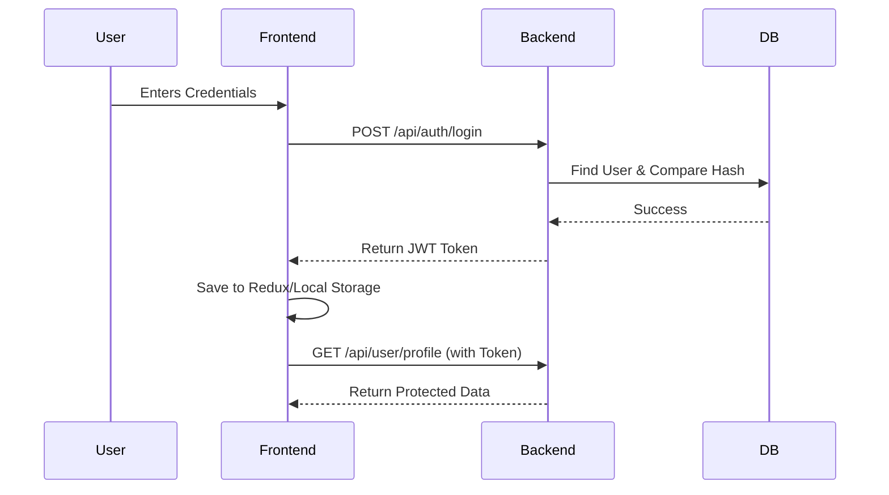

## CHAPTER 6: Authentication

Authentication is handled securely using JSON Web Tokens (JWT) and HTTP Bearer headers.

### Authentication Flow
1. **Registration**: The user submits their name, email, and password. The backend hashes the password using `bcrypt`, saves the user, and triggers an email containing a verification link with a temporary token.
2. **Email Verification**: The user clicks the link. The frontend extracts the token from the URL and hits `GET /api/auth/verify-email/:token`. The backend marks `isVerified = true`.
3. **Login**: The user provides credentials. The backend verifies the password using `bcrypt.compare`. If successful, a JWT is signed using `jsonwebtoken` and returned.
4. **Protected Routes**: The frontend saves the JWT. For any secure API call, it attaches `Authorization: Bearer <token>`. The backend `protect` middleware decodes this token to authenticate `req.user`.

---

## CHAPTER 7: User Module

The User Module is the core experience for retail traders. 

### Pages & Features
- **Dashboard (`/dashboard`)**: The landing area post-login. Displays quick portfolio stats, a market overview, and recent notifications.
- **Portfolio (`/portfolio`)**: A detailed breakdown of all owned assets. Includes average buy price, current market price, and unrealized PnL (Profit and Loss).
- **Trading (`/trade`)**: The interface for executing market orders. 
  - **Purpose**: Allow users to instantly convert fiat (Wallet balance) into digital assets.
  - **Flow**: User selects asset -> inputs quantity -> clicks 'Buy' -> Backend verifies wallet balance -> Deducts fiat -> Adds asset to Portfolio.
- **Profile & KYC (`/profile`, `/kyc`)**: Displays user details and the Drag-and-Drop identity document uploader.

---

## CHAPTER 8: Admin Module

The Admin Module is restricted to users with `role: 'admin'`. It provides a God-eye view of the system.

### Pages & Features
- **Admin Login (`/admin/login`)**: A separate authentication flow to prevent standard users from accidentally stumbling into admin routes.
- **User Management (`/admin/users`)**: Displays a table of all registered users. Admins can view individual portfolios, freeze accounts, or view transaction histories.
- **KYC Approval (`/admin/kyc`)**:
  - **Purpose**: Regulatory compliance.
  - **Flow**: Admin sees a table of `pending` KYC requests. Clicking 'Review' opens a full-screen modal to inspect the uploaded `identityDocument`. The admin can click 'Approve' or 'Reject' (requiring remarks).
- **System Analytics**: Utilizes Recharts to show system-wide metrics: Total volume traded, total fiat deposits, and active user growth over time.

---

## CHAPTER 9: Trading Module

The Trading Module governs the exchange of fiat currency for assets.

### Order Execution Logic (Backend)
1. User requests to buy 10 units of "AAPL" at current market price.
2. The `tradeController` initiates a **Mongoose Session / Transaction**.
3. It calculates `totalCost = 10 * currentPrice`.
4. It checks if `User.walletBalance >= totalCost`. If not, it throws `400 Insufficient Funds`.
5. It deducts `totalCost` from `User.walletBalance`.
6. It creates a new `Order` record.
7. It creates a new `Transaction` ledger entry.
8. It updates the `Portfolio`, either adding a new holding or updating the `averageBuyPrice` of an existing holding.
9. It commits the transaction. If any step fails, the entire operation rolls back, ensuring absolute financial data integrity.

---

## CHAPTER 10: Wallet

The Wallet acts as the user's fiat ledger.

### Features
- **Deposit**: Adding funds via an external gateway.
- **Withdrawal**: Users request to pull funds out to their bank account.
  - **Flow**: User requests withdrawal -> Funds are temporarily locked (`walletBalance` decreases, `pendingWithdrawals` increases) -> Admin reviews -> Admin approves (funds permanently removed) or rejects (funds returned to `walletBalance`).
- **Fee Calculation**: The system can optionally deduct a flat or percentage fee during deposits/withdrawals, which is credited to an Admin/System wallet.

---

## CHAPTER 11: Payment Integration

The application integrates **Razorpay** for seamless fiat deposits (Specifically designed for INR / Indian markets, but adaptable).

### Deposit Flow
1. **Order Creation**: Frontend requests a deposit of ₹5000. Backend calls Razorpay API to create an order and returns the `order_id`.
2. **Payment Checkout**: Frontend opens the Razorpay UI widget using the `order_id`. The user completes the payment via Card, UPI, or NetBanking.
3. **Payment Verification**: Razorpay returns a `payment_id` and `signature`. The frontend sends these to the backend. The backend cryptographically verifies the signature using the Razorpay Webhook Secret.
4. **Credit**: If valid, the backend updates the User's `walletBalance` and marks the `Transaction` as `success`.

---

## CHAPTER 12: KYC (Know Your Customer)

A massive enterprise feature designed to comply with Anti-Money Laundering (AML) laws.

### Implementation Details
- **Frontend**: A custom Drag-and-Drop component in `KYCPage.jsx`. Requires users to upload a single clear `identityDocument` (PAN, Aadhaar, Passport).
- **Backend**: `uploadMiddleware` (Multer) intercepts the `multipart/form-data`, validates that it is a JPEG, PNG, or PDF under 10MB, and saves it securely to the `/uploads/kyc` directory on the server disk.
- **Admin Review**: Admins use a dedicated UI to view the image/PDF and approve or reject it.

---

## CHAPTER 13: Notifications

Provides asynchronous updates to the user regarding their account state.

### Types
- **Email Notifications**: Powered by `Nodemailer`. Sent for critical events: Welcome Registration, Password Resets, and KYC Approval/Rejection.
- **In-App Notifications**: Stored in the `notifications` MongoDB collection and displayed in the frontend header bell icon. Used for: Trade execution confirmations, Wallet deposit success, and general system announcements.
